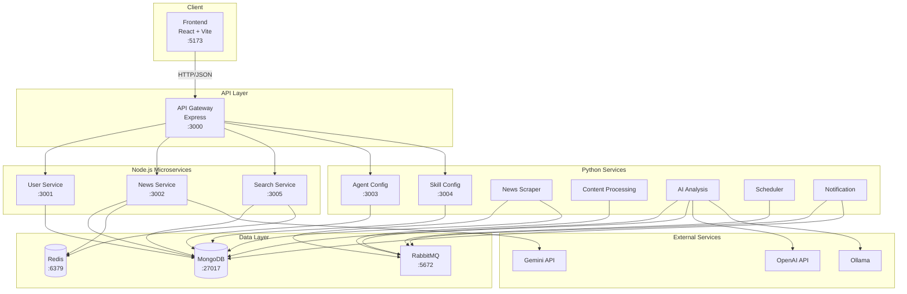

# CoreGist News - System Architecture

**Last Updated:** 2026-04-27  
**Status:** Production-ready microservices architecture

> **Note:** This architecture document reflects the current state after codebase cleanup and optimization.  
> See [CLEANUP_REPORT.md](CLEANUP_REPORT.md) for details on removed redundant files and structural improvements.

## Table of Contents

1. [System Overview](#system-overview)
2. [Architecture Diagram](#architecture-diagram)
3. [Service Mapping](#service-mapping)
4. [API Gateway Routes](#api-gateway-routes)
5. [Frontend Integration](#frontend-integration)
6. [Development Guide](#development-guide)
7. [Deployment](#deployment)

---

## System Overview

CoreGist News is an **AI-powered news aggregation platform** built with a **microservices architecture**. The system crawls news from multiple international sources, processes them through AI-powered summarization, and presents them in both English and Chinese.

### Core Components

- **Frontend**: React 18.2 + TypeScript + Vite (Port 5173)
- **API Gateway**: Express 5.1 (Port 3000) - Single entry point for all API requests
- **User Service**: Express (Port 3001) - Authentication, profiles, settings, tracking
- **News Service**: Express (Port 3002) - News CRUD, search, AI analysis
- **Search Service**: Express (Port 3005) - Advanced search and recommendations
- **Python Services**: Agent/Skill config, scraping, AI analysis, notifications
- **Database**: MongoDB (Port 27017)
- **Message Queue**: RabbitMQ (Port 5672)
- **Cache**: Redis (Port 6379)

### Key Features

- Multi-source news aggregation (BBC, Al Jazeera, DW, CBC, etc.)
- AI-powered dual-language summarization (GPT, Gemini, Ollama)
- User authentication (Email/Password + Google OAuth)
- Personalized news recommendations
- Topic tracking system
- Customizable push notifications
- Multi-language UI (Chinese, English, Traditional Chinese)

---

## Architecture Diagram



---

## Service Mapping

### Port Allocation

| Service | Port | Technology | Purpose |
|---------|------|------------|---------|
| Frontend | 5173 | Vite Dev Server | Web UI |
| Gateway | 3000 | Express | API Gateway |
| User Service | 3001 | Express | User management |
| News Service | 3002 | Express | News operations |
| Agent Config | 3003 | Python/Flask | Agent configuration |
| Skill Config | 3004 | Python/Flask | Skill configuration |
| Search Service | 3005 | Express | Search & recommendations |
| MongoDB | 27017 | MongoDB 7 | Primary database |
| RabbitMQ | 5672 | RabbitMQ 3 | Message queue |
| Redis | 6379 | Redis 7 | Cache layer |

### Service Responsibilities

#### User Service (Node.js)
- **Authentication**: Login, register, password reset, Google OAuth
- **User Profiles**: Profile management, avatar, settings
- **Tracking Topics**: Create, read, update, delete tracking topics
- **Analytics**: User activity and topic analytics

#### News Service (Node.js)
- **News CRUD**: Create, read, update news articles
- **Search**: Keyword search, filtering, pagination
- **AI Search**: Gemini-powered semantic search
- **User State**: Track read/hidden/favorited news per user

#### Search Service (Node.js)
- **Advanced Search**: Full-text search with MongoDB Atlas
- **Recommendations**: Personalized news recommendations
- **Caching**: Redis-based search result caching

#### Python Services
- **News Scraper**: RSS feed ingestion, web scraping
- **Content Processing**: HTML cleaning, text extraction
- **AI Analysis**: Summarization, classification, sentiment analysis
- **Scheduler**: Periodic scraping tasks
- **Notification**: Push notification delivery
- **Agent/Skill Config**: AI agent and skill management

---

## API Gateway Routes

The Gateway (`backend/gateway/app.js`) is the **single entry point** for all frontend requests.

### Route Forwarding Table

| Gateway Route | Target Service | Target Path | Auth Required |
|---------------|----------------|-------------|---------------|
| `/api/health` | Gateway | - | No |
| `/api/auth/*` | User Service | `/auth/*` | No |
| `/api/user/*` | User Service | `/user/*` | Yes |
| `/api/users/*` | User Service | `/user/*` | Yes |
| `/api/tracking/*` | User Service | `/tracking/*` | Yes |
| `/api/news/*` | News Service | `/news/*` | Partial |
| `/api/news/search` | Search Service | `/news/search` | No |
| `/api/search` | Search Service | `/search` | No |
| `/api/ai-search` | News Service | `/ai-search` | No |
| `/api/agents/*` | Agent Config | `/agents/*` | Yes |
| `/api/skills/*` | Skill Config | `/skills/*` | Yes |

### Authentication

- **Method**: JWT (JSON Web Tokens)
- **Header**: `Authorization: Bearer <token>`
- **Token Types**:
  - Access Token: 7 days (configurable)
  - Refresh Token: 30 days (configurable)
- **Alternative**: Firebase tokens (for Google OAuth)

---

## Frontend Integration

### API Client Configuration

```typescript
// frontend/src/api/apiClient.ts
const API_BASE_URL = import.meta.env.VITE_API_URL || 'http://localhost:3000/api';
```

### Page to Service Mapping

| Frontend Page | API Endpoint | Service | Auth |
|---------------|--------------|---------|------|
| `/login` | `POST /api/auth/login` | User Service | No |
| `/register` | `POST /api/auth/register` | User Service | No |
| `/profile` | `GET /api/auth/me` | User Service | Yes |
| `/profile/edit` | `PUT /api/user/profile` | User Service | Yes |
| `/news` | `GET /api/news` | News Service | No |
| `/news/:id` | `GET /api/news/:id` | News Service | No |
| `/news/search` | `GET /api/news/search` | Search Service | No |
| `/home/news-push` | `GET /api/user/settings` | User Service | Yes |
| `/home/targeted-tracking` | `GET /api/tracking/topics` | User Service | Yes |

### State Management

- **Context API**: User authentication state
- **Local Storage**: JWT tokens, user preferences
- **Session Storage**: Temporary UI state

---

## Development Guide

### Prerequisites

- Node.js 18+
- Python 3.10+
- MongoDB 7+
- RabbitMQ 3+ (optional for full stack)
- Redis 7+ (optional for caching)

### Quick Start

```bash
# Install dependencies
npm install
cd frontend && npm install
cd ../backend && npm install
pip install -r backend/requirements.txt

# Start all services
npm run dev
```

This command:
1. Starts MongoDB (if installed locally)
2. Starts RabbitMQ (if installed locally)
3. Starts all Node.js microservices
4. Starts Python services
5. Starts frontend dev server

### Individual Service Commands

```bash
# Gateway only
npm --prefix backend run start:gateway

# User service only
npm --prefix backend run start:user-service

# News service only
npm --prefix backend run start:news-service

# Frontend only
npm --prefix frontend run dev
```

### Health Check

```bash
# Check all services
curl http://localhost:3000/api/health

# Expected response
{
  "status": "ok",
  "services": [
    {"name": "user-service", "ok": true, "status": 200},
    {"name": "news-service", "ok": true, "status": 200},
    ...
  ],
  "time": "2026-04-27T10:00:00.000Z"
}
```

### Environment Variables

Create `.env` files in `backend/` and `frontend/`:

**backend/.env**:
```env
# Database
MONGODB_URI=mongodb://localhost:27017/coregistnews

# JWT Secrets
JWT_SECRET=your-secret-key
JWT_REFRESH_SECRET=your-refresh-secret

# Google OAuth
GOOGLE_CLIENT_ID=your-google-client-id

# AI Services
OPENAI_API_KEY=your-openai-key
GEMINI_API_KEY=your-gemini-key

# Message Queue
RABBITMQ_URL=amqp://localhost:5672

# Redis
REDIS_URL=redis://localhost:6379
```

**frontend/.env**:
```env
VITE_API_URL=http://localhost:3000/api
VITE_GOOGLE_CLIENT_ID=your-google-client-id
```

---

## Deployment

### Docker Deployment

```bash
# Build and start all services
docker-compose up -d

# Check logs
docker-compose logs -f

# Stop all services
docker-compose down
```

### Production Considerations

1. **Environment Variables**: Use production secrets
2. **Database**: Use MongoDB Atlas or managed MongoDB
3. **Message Queue**: Use CloudAMQP or managed RabbitMQ
4. **Caching**: Use Redis Cloud or managed Redis
5. **Frontend**: Build and serve static files via CDN
6. **API Gateway**: Use NGINX or cloud load balancer
7. **SSL/TLS**: Enable HTTPS for all services
8. **Monitoring**: Set up logging and alerting

### Scaling Strategy

- **Horizontal Scaling**: Run multiple instances of each service
- **Load Balancing**: Use NGINX or cloud load balancer
- **Database**: MongoDB replica sets for high availability
- **Caching**: Redis cluster for distributed caching
- **Message Queue**: RabbitMQ cluster for reliability

---

## Legacy Components

### backend/legacy/server.js

**Status**: Deprecated, kept for rollback only  
**Purpose**: Original monolithic server  
**Usage**: Do NOT add new features here

The legacy server is preserved for:
- Emergency rollback
- Debugging and comparison
- Historical reference

All new development should use the microservices architecture.

---

## Migration Notes

### Completed Migrations

✅ Authentication → User Service  
✅ User profiles → User Service  
✅ User settings → User Service  
✅ Tracking topics → User Service  
✅ News CRUD → News Service  
✅ News search → Search Service  
✅ AI search → News Service  

### Architecture Evolution

1. **Phase 1** (2024): Monolithic server (`backend/server.js`)
2. **Phase 2** (2025): Gateway + microservices split
3. **Phase 3** (2026): Python services for AI/scraping
4. **Current**: Fully microservices architecture

---

## Troubleshooting

### Common Issues

**Issue**: Services can't connect to MongoDB  
**Solution**: Check `MONGODB_URI` in `.env`, ensure MongoDB is running

**Issue**: Frontend shows 502 errors  
**Solution**: Verify all backend services are running via `/api/health`

**Issue**: Python services fail to start  
**Solution**: Install dependencies: `pip install -r backend/requirements.txt`

**Issue**: RabbitMQ connection errors  
**Solution**: Start RabbitMQ or set `RABBITMQ_URL` to cloud instance

### Debug Commands

```bash
# Check service status
curl http://localhost:3000/api/health

# Check MongoDB connection
mongosh mongodb://localhost:27017/coregistnews

# Check RabbitMQ
rabbitmqctl status

# Check Redis
redis-cli ping

# View service logs
docker-compose logs -f [service-name]
```

---

## Contributing

### Code Organization

```
coregist-news/
├── frontend/              # React frontend
│   ├── src/
│   │   ├── api/          # API clients
│   │   ├── features/     # Feature modules
│   │   ├── shared/       # Shared components
│   │   └── app/          # App entry
│   └── package.json
├── backend/
│   ├── gateway/          # API Gateway
│   ├── services/         # Microservices
│   │   ├── user-service/
│   │   ├── news-service/
│   │   └── search-service/
│   ├── pipeline/         # Scraping & processing
│   ├── ai/              # AI agents & skills
│   ├── models/          # Shared data models
│   └── legacy/          # Deprecated monolith
├── docs/                # Documentation
└── packages/            # Shared packages
```

### Development Workflow

1. Create feature branch from `main`
2. Develop and test locally
3. Run health checks: `curl http://localhost:3000/api/health`
4. Commit with descriptive messages
5. Create pull request
6. Code review and merge

---

## References

- [Frontend Documentation](./frontend/README.md)
- [Backend Documentation](./backend/README.md)
- [API Documentation](./api/README.md)
- [Deployment Guide](./runbooks/DEPLOYMENT.md)

---

**For questions or issues, please contact the development team.**
