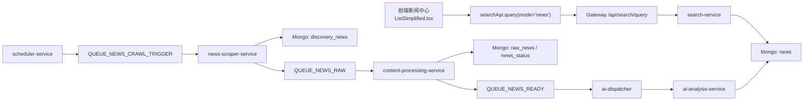

# 新闻中心数据线程与排查指南

## 1. 页面到数据库的真实链路

新闻中心不是直接读取新闻服务列表，而是统一走搜索服务。

结论：

- 新闻中心只看 `news`
- `discovery_news` 只是 RSS 发现层
- `raw_news / news_status` 只是全文抓取、清洗、AI 中间层
- 如果 `news=0`，页面就会空白

## 2. 前端主链

### 2.1 新闻中心

- 页面：`frontend/src/pages/news/ListSimplified.tsx`
- 客户端：`frontend/src/api/apiClient.ts`
- 调用：
  - `POST /api/search/query`
  - `mode = "news"`
  - `allow_discovery = false`

语义：

- 新闻中心是公共新闻流
- 未登录也允许访问
- 只展示最终 `news` 集合里的内容

### 2.2 我的新闻

- 仍然走用户私有链路
- 依赖 `user_news_maps`
- 登录后才能看到

## 3. 搜索服务分流逻辑

### 3.1 `mode = "news"`

- 允许匿名访问
- 查询目标：`news`
- 返回公共新闻列表

### 3.2 `mode = "ai"`

- 需要登录
- 查询目标：`user_news_maps + news`
- 允许创建异步搜索任务

### 3.3 任务接口

- `GET /api/search/jobs/:jobId`
- `POST /api/search/jobs/:jobId/retry`

这两条继续要求登录，因为它们属于用户私有任务。

## 4. `npm run dev` 必须拉起的服务

当前开发环境要让新闻中心自动有内容，至少需要这些服务：

- `gateway`
- `user-service`
- `news-service`
- `search-service`
- `scheduler-service`
- `news-scraper-service`
- `content-processing-service`
- `ai-dispatcher-service`
- `ai-analysis-service`

其中最关键的是：

- `scheduler-service`
  - 负责定时触发 RSS 公共抓取
- `news-scraper-service`
  - 负责把 RSS 发现推进到 raw 队列
- `content-processing-service`
  - 负责清洗正文与质量门槛
- `ai-analysis-service`
  - 负责最终写入 `news`

## 5. 公共新闻健康视图

开发环境新增公共内容诊断口：

- `GET /api/search/public-health`

返回至少包含：

- `news_count`
- `raw_ready_count`
- `raw_processing_count`
- `discovery_count`
- `last_completed_news_at`

用途：

- 快速判断页面空白卡在哪一层

## 6. 新闻中心为空时的标准排查顺序

### 第一步：看最终展示层

检查：

- `GET /api/search/public-health`

如果：

- `news_count > 0`

说明页面空白不是供给问题，而是前端请求或渲染问题。

### 第二步：看 raw/AI 中间层

如果：

- `news_count = 0`
- 但 `raw_ready_count > 0` 或 `raw_processing_count > 0`

说明：

- RSS 和全文抓取已经在工作
- 卡点在 `ai-dispatcher` 或 `ai-analysis`

### 第三步：看 discovery 层

如果：

- `news_count = 0`
- `raw_ready_count = 0`
- `raw_processing_count = 0`
- `discovery_count > 0`

说明：

- RSS 发现已经有内容
- 但没有继续推进到 `raw_news`
- 重点检查 `news-scraper-service` 是否真正发布 `QUEUE_NEWS_RAW`

### 第四步：看 scheduler / RSS

如果：

- `news_count = 0`
- `raw_* = 0`
- `discovery_count = 0`

说明：

- 公共抓取根本没有启动
- 先检查：
  - `scheduler-service` 是否运行
  - `QUEUE_NEWS_CRAWL_TRIGGER` 是否被触发
  - RSS 源是否可访问

## 7. 当前产品语义

- 新闻中心：公共自动供给
- 我的新闻：用户私有结果
- AI 搜索：登录后可用的私有搜索任务

这三者现在已经明确分离，不再互相混淆。
