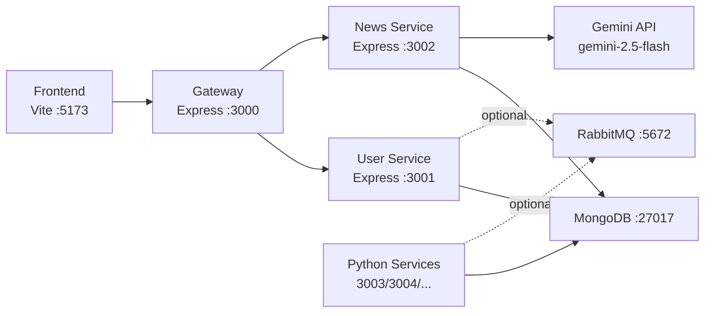

# CoreGist News 前后端对接审计

更新时间：2026-04-07

## 1. 结论摘要

当前项目的真实运行形态不是“前端 + 单体后端”，而是：

- 前端：React + TypeScript + Vite，入口在 `frontend/src/app/App.tsx`
- 后端推荐入口：Gateway，入口在 `backend/gateway/app.js`
- 用户服务：`backend/services/user-service/app.js`
- 新闻服务：`backend/services/news-service/app.js`
- 旧单体兼容入口：`backend/server.js`
- Python 离线/配置服务：`backend/services/*`

这轮审计后，已经完成以下关键对齐：

- 前端本地默认 API 从 `localhost:8000/api` 改为 `localhost:3000/api`
- 根目录 `npm run dev` 改为先启动完整本地后端，再启动前端
- 用户资料链路已补齐 `avatar / phone / birthday`
- 编辑资料页头像保存从“前端 multipart 上传”改为“兼容网关的 JSON 更新”
- 旧单体 `server.js` 与微服务用户链路字段保持一致

## 2. 真实系统图



推荐本地端口：

- 前端：`5173`
- 网关：`3000`
- 用户服务：`3001`
- 新闻服务：`3002`
- MongoDB：`27017`
- RabbitMQ：`5672`

## 3. 前端页面到后端服务映射

### 3.1 登录与账户

| 前端页面 | 前端 API | 网关入口 | 实际服务 | 鉴权 | 主要模型 |
|---|---|---|---|---|---|
| `/login` | `authApi.login` | `/api/auth/login` | user-service `/auth/login` | 无 | `User` |
| `/login` | `authApi.loginWithGoogle` | `/api/auth/google` | user-service `/auth/google` | 无 | `User` |
| `/register` | `authApi.register` | `/api/auth/register` | user-service `/auth/register` | 无 | `User` |
| `/forgot-password` | `authApi.sendResetCode` / `resetPassword` | `/api/auth/send-reset-code` / `/api/auth/reset-password` | user-service | 无 | `User` |
| `/profile` | `authApi.getCurrentUser` | `/api/auth/me` | user-service `/auth/me` | JWT 或 Firebase token | `User` |
| `/profile/edit-profile` | `authApi.updateProfile` | `/api/user/profile` | user-service `/user/profile` | JWT 或 Firebase token | `User` |

### 3.2 新闻中心

| 前端页面 | 前端 API | 网关入口 | 实际服务 | 鉴权 | 主要模型 |
|---|---|---|---|---|---|
| `/news` | `newsApi.getNews` | `/api/news` | news-service `/news` | 可匿名，登录后过滤已读/隐藏 | `News`, `UserNewsState` |
| `/news/:id` | `newsApi.getNewsDetail` | `/api/news/:id` | news-service `/news/:id` | 无 | `News` |
| 推送新闻列表 | `newsApi.getNews` | `/api/news` | news-service `/news` | 可匿名 | `News` |
| 搜索/个性化推荐 | `newsApi.searchNews` | `/api/news/search` | news-service `/news/search` | 登录后读取用户推送关键词 | `News`, `User`, `UserNewsState` |
| AI 搜索 | `POST /api/ai-search` | `/api/ai-search` | news-service `/ai-search` | 无 | `News` + Gemini |

### 3.3 新闻推送

| 前端页面 | 前端 API | 网关入口 | 实际服务 | 鉴权 | 主要模型 |
|---|---|---|---|---|---|
| `/home/news-push` | `userSettingsApi.getSettings` | `/api/user/settings` | user-service `/user/settings` | JWT 或 Firebase token | `User` |
| `/home/news-push` | `userSettingsApi.updateSettings` | `/api/user/settings` | user-service `/user/settings` | JWT 或 Firebase token | `User` |
| `/home/news-push/:id/news` | `newsApi.getNews` + 前端关键词过滤 | `/api/news` | news-service `/news` | 可匿名 | `News` |

说明：

- “我的新闻”当前本质上是“推送配置入口 + 基于关键词的新闻视图”，不是单独持久化表。
- 前端原有“保存失败时本地暂存”逻辑仍保留，用于弱网兜底。

### 3.4 定向追踪

| 前端页面 | 前端 API | 网关入口 | 实际服务 | 鉴权 | 主要模型 |
|---|---|---|---|---|---|
| `/home/targeted-tracking` | `trackingApi.getTopics` | `/api/tracking/topics` | user-service `/tracking/topics` | JWT 或 Firebase token | `TrackingTopic`, `News` |
| `/home/targeted-tracking` | `trackingApi.createTopic` | `/api/tracking/topics` | user-service `/tracking/topics` | JWT 或 Firebase token | `TrackingTopic` |
| `/home/targeted-tracking` | `trackingApi.deleteTopic` | `/api/tracking/topics/:id` | user-service `/tracking/topics/:id` | JWT 或 Firebase token | `TrackingTopic` |
| `/home/targeted-tracking` | `trackingApi.getAnalytics` | `/api/tracking/analytics` | user-service `/tracking/analytics` | JWT 或 Firebase token | `TrackingTopic`, `News` |
| `/home/targeted-tracking/:id/timeline` | `trackingApi.getTopicNews` | `/api/tracking/topics/:id/news` | user-service `/tracking/topics/:id/news` | JWT 或 Firebase token | `TrackingTopic`, `News` |

## 4. 旧单体与新架构边界

### 已完成迁移并有网关承接的能力

- 用户名检查
- 注册 / 登录 / 刷新 token
- 重置密码
- Google 登录
- 当前用户信息
- 用户资料更新
- 用户设置
- 追踪主题
- 新闻列表 / 搜索 / 详情
- 新闻状态更新
- AI 搜索

### 仍保留旧单体的原因

- `backend/server.js` 作为兼容/回滚入口仍然存在
- 某些历史调试习惯仍可能直接指向 `8000`

### 当前推荐路径

- 本地开发：`gateway -> user-service/news-service`
- `server.js` 仅作为旧路径兼容，不再作为主开发入口

## 5. 已修复的明确错配

### 5.1 本地 API 基址错误

修复前：

- 前端 `frontend/src/api/apiClient.ts` 本地默认请求 `localhost:8000/api`

修复后：

- 改为请求网关 `localhost:3000/api`

### 5.2 编辑资料头像保存链路断裂

问题：

- 前端资料页调用 `uploadAvatar`
- 网关当前只做 JSON 转发，不支持 multipart 文件上传透传
- 后端也没有对应 `/user/avatar` 路由

修复：

- 前端将头像转为 data URL，通过 `/api/user/profile` 走 JSON 更新
- 后端 `User` 模型与 `/auth/me`、`/user/profile` 已补齐 `avatar_url`

### 5.3 用户资料字段不完整

问题：

- 前端页面有 `phone`、`birthday`
- 后端模型和响应未完整承接

修复：

- `backend/models/User.js` 增加 `phone`、`birthday`
- user-service 与 legacy server 均返回并更新这些字段

### 5.4 本地整套启动入口不正确

问题：

- 根目录原 `npm run dev` 只会起 gateway，不会拉起 user-service/news-service

修复：

- 根目录 `npm run dev` 已改为：
  - 先执行 `backend/scripts/start-local-backend.sh`
  - 再启动前端 Vite

## 6. 风险清单

### 已确认风险

1. `frontend/README.md` 的路由文档过时  
   文档仍写 `/app/*`，实际代码已是 `/home`、`/news`、`/profile`

2. 项目同时保留两套 API 封装  
   `frontend/src/api/apiClient.ts` 与 `frontend/src/api/auth.ts` 有职责重叠，后续应统一

3. 项目同时保留微服务入口与旧单体入口  
   容易让本地调试误连到 `8000`

4. `.env` 中包含真实外部服务配置  
   后续应脱敏并轮换敏感值

5. Python 配置/抓取服务依赖本地 Python 环境  
   已让启动脚本优先使用项目 `.venv`，但仍需确保依赖完整

## 7. 本地运行建议

推荐命令：

```bash
npm run dev
```

该命令现在会：

1. 启动 MongoDB（若本机已安装）
2. 启动 RabbitMQ（若本机已安装或可用）
3. 启动 user-service、news-service、gateway 与 Python 服务
4. 启动前端 Vite 开发服务器

如需单独检查后端健康：

```bash
curl http://127.0.0.1:3000/api/health
```

## 8. 审计判定

当前项目已经从“前后端默认不一致”修正到“前端以网关为中心对接后端服务”。

还需要持续关注的不是主链路是否存在，而是：

- 文档是否继续引用旧端口/旧路由
- 是否继续新增绕开网关的前端调用
- Python 服务与消息队列依赖是否在每台开发机上都一致
