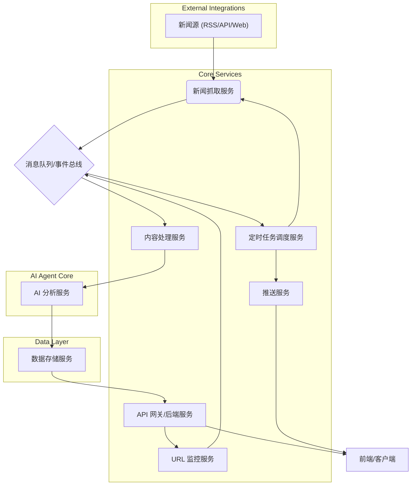

# AI Agent 后端改造全局指导手册

## 1. 引言

本手册旨在为 AI Agent 新闻项目后端改造提供全面的指导，确保改造过程遵循统一的架构原则、技术规范和开发流程。核心目标是将现有 `coregist-news` 项目升级为一个功能强大、智能且高效的 AI Agent 新闻分析系统，并有效管理大语言模型（LLM）的 Token 消耗，提升系统灵活性、可维护性及分析深度。

本手册整合了前期对 `coregist-news` 项目的分析、对 `BettaFish`、`MiroFish` 和 `worldmonitor` 等参考项目的调研启发，以及 Agent 库和 Skills 库的详细设计，并吸取了 `open-webSearch`、`anthropics/skills`、`davepoon/buildwithclaude` 等开源项目的优秀实践，最终形成一套可行的技术栈、模块划分和分阶段实施计划。

## 2. 现有项目 `coregist-news` 分析

`coregist-news` 项目已具备新闻抓取、LLM 集成和基本的用户管理功能，为后续开发奠定了良好基础。

### 2.1 技术栈

*   **后端框架**: Node.js (Express)
*   **数据库**: MongoDB (通过 Mongoose ODM)
*   **LLM 集成**: Python 脚本 (通过 `openai`、`google-generativeai` 等库)，支持 GPT、Gemini、Ollama 等多种模型。
*   **爬虫**: Python 脚本 (基于 `RequestsScraper` 和 `RSSFetcher`，结合 `BeautifulSoup` 进行 HTML 清洗和内容提取)。

### 2.2 已实现功能

在新闻抓取方面，`coregist-news` 项目已能通过 RSS 源（例如 `crawer_bbc.py`）抓取新闻内容，并支持多源配置。抓取到的 HTML 内容会经过 `Scrubber` 模块进行正文提取和噪声去除，实现初步的内容清洗。项目还集成了 LLM 处理能力，能够调用大模型对新闻进行多方面的分析，包括生成中英文摘要（通过 `summarize_with_gpt4_dual`、`summarize_with_gemini` 等函数）、依据 `news_prompt.py` 中定义的分类体系进行一级和二级分类、生成中英文关键词标签，以及对新闻内容进行 1-10 的整数评分。所有经过处理的新闻数据最终会存储到 MongoDB 的 `News` 模型中。

此外，`coregist-news` 也具备基础的用户管理功能，包括用户认证、注册和登录，这些功能通过 `User` 模型实现。用户对新闻的阅读、隐藏、收藏状态则由 `UserNewsState` 模型记录。项目还支持用户定义和跟踪关注的主题和关键词，这些信息存储在 `TrackingTopic` 模型中。

### 2.3 优势与待完善点

**优势**:

该项目的优势在于其**模块化的 LLM 集成**，方便未来切换和扩展不同的大模型服务。同时，**清晰的抓取流程**，从 RSS 抓取到内容清洗、LLM 处理再到入库，整个流程明确且易于理解。此外，项目已具备**基础的用户体系**，包括用户和新闻状态管理，为后续功能的扩展提供了坚实的基础。

**待完善点**:

然而，项目也存在一些待完善点。首先，**新闻搜索的全面性**有待提高，目前主要依赖 RSS 源，未来需要扩展到更广泛的网页抓取和搜索引擎集成。其次，**褒贬性判断**功能尚不完善，现有 LLM 仅进行摘要和评分，缺乏对新闻事实性、偏向性的深入分析。第三，**评价性判断维度**较为单一，需要增加信息密度、真假性、影响力、传播范围等考量。第四，**定时推送功能**目前仅有用户推送设置的数据结构，缺乏实际的调度和推送逻辑。最后，**定向检查 URL** 功能也需要从现有侧重 RSS 源校验的 `FeedsValidator` 扩展为通用的 URL 内容监控。

## 3. 核心理念：多 Agent 协作与任务分解

为了解决现有项目的待完善点，并有效管理 Token 消耗，我们将引入**多 Agent 协作与任务分解**的架构。该策略旨在通过将复杂任务拆解为多个专业 Agent 负责的子任务，并为这些 Agent 提供一套可调用的工具（Skills），从而优化大语言模型（LLM）的 Token 消耗，提升系统灵活性和可维护性。

### 3.1 理念阐述

传统的单一 LLM 模式在处理复杂任务时，往往面临 Token 消耗高、上下文管理困难、任务执行效率低等问题。多 Agent 协作模式通过以下方式解决这些挑战：

*   **任务分解**：将一个宏观任务（如“新闻分析”）分解为多个微观、专业的子任务（如“新闻搜索”、“内容摘要”、“褒贬判断”）。
*   **专业化 Agent**：为每个子任务设计一个专门的 Agent，该 Agent 拥有特定的职责、Prompt 模板和可调用的 Skills。这使得每个 Agent 都能在有限的上下文中高效完成其专业工作。
*   **协作与编排**：Agent 之间通过明确的接口和消息机制进行信息交换和任务流转，形成一个协作网络。一个中央协调器（或更高级别的 Agent）负责编排 Agent 的执行顺序和决策。
*   **Token 优化**：每个 Agent 在执行任务时，只需关注其子任务相关的上下文信息，从而显著减少每次 LLM 调用的 Token 数量。同时，可以根据子任务的复杂度和重要性，为不同 Agent 配置不同性能和成本的 LLM 模型（例如，搜索 Agent 使用更经济的模型，评估 Agent 使用更强大的模型）。

### 3.2 Agent 库设计 (Agent Registry)

Agent 库将作为所有 AI Agent 的注册中心，明确每个 Agent 的职责、配置和可用的工具。每个 Agent 都将是一个独立的逻辑单元，负责完成特定的任务。

#### 3.2.1 Agent 核心数据结构

我们将定义一个 `Agent` 类或数据结构，包含以下核心属性：

| 属性名         | 类型           | 描述                                                                 | 示例                                      |
| :------------- | :------------- | :------------------------------------------------------------------- | :---------------------------------------- |
| `id`           | `str`          | Agent 的唯一标识符                                                   | `search_agent`                            |
| `name`         | `str`          | Agent 的人类可读名称                                                 | `新闻搜索代理`                            |
| `description`  | `str`          | Agent 的详细职责描述                                                 | `负责从多个新闻源和搜索引擎获取相关新闻链接和内容。` |
| `agent_type`   | `enum`         | Agent 的类型，如 `SEARCH`, `SUMMARIZATION`, `EVALUATION`, `BIAS_DETECTION`, `REVIEW` | `AgentType.SEARCH`                        |
| `llm_config`   | `dict`         | LLM 模型配置，包括模型名称、API Key、温度等参数                    | `{"model": "gpt-4", "api_key": "...", "temperature": 0.7}` |
| `prompt_template` | `str`          | 专用于该 Agent 的 Prompt 模板                                        | `"你是一个新闻搜索专家，请根据以下关键词搜索新闻：{query}"` |
| `available_skills` | `List[str]`    | 该 Agent 可以调用的 Skills 列表 (通过 Skill ID 引用)                 | `["web_search", "content_scraper"]`     |

#### 3.2.2 Agent 类型 (AgentType)

为了更好地分类和管理 Agent，我们将定义以下几种 Agent 类型：

| AgentType        | 描述                                     | 对应功能                                     |
| :--------------- | :--------------------------------------- | :------------------------------------------- |
| `SEARCH`         | 负责新闻内容的搜索和获取                 | 新闻搜索、定向检查 URL                       |
| `SUMMARIZATION`  | 负责新闻内容的摘要生成                   | 新闻的阅读后进行摘要                         |
| `BIAS_DETECTION` | 负责新闻的褒贬性判断                     | 新闻的褒贬性判断                             |
| `EVALUATION`     | 负责新闻的评价性判断 (打分)              | 新闻的评价性判断                             |
| `REVIEW`         | 负责对其他 Agent 的输出进行审核和修正    | 确保输出质量和准确性                         |
| `SCHEDULER`      | 负责任务的调度和触发                     | 定时推送功能                                 |

#### 3.2.3 Agent 注册与管理

我们将实现一个 `AgentRegistry` 类，用于注册、查找和管理 Agent 实例。这将确保 Agent 的可发现性和可配置性。

```python
class AgentRegistry:
    def __init__(self):
        self._agents = {}

    def register_agent(self, agent_instance: Agent):
        if agent_instance.id in self._agents:
            raise ValueError(f"Agent with ID {agent_instance.id} already registered.")
        self._agents[agent_instance.id] = agent_instance

    def get_agent(self, agent_id: str) -> Agent:
        agent = self._agents.get(agent_id)
        if not agent:
            raise ValueError(f"Agent with ID {agent_id} not found.")
        return agent

    def list_agents(self) -> List[Agent]:
        return list(self._agents.values())
```

### 3.3 Skills 库设计 (Skillset)

Skills 库将提供一系列可供 Agent 调用的工具和能力。每个 Skill 都将是一个封装了特定功能的函数或方法，Agent 可以根据任务需求选择调用。

#### 3.3.1 Skill 核心数据结构

我们将定义一个 `Skill` 类或数据结构，包含以下核心属性：

| 属性名        | 类型           | 描述                                                                 | 示例                                        |
| :------------ | :------------- | :------------------------------------------------------------------- | :------------------------------------------ |
| `id`          | `str`          | Skill 的唯一标识符                                                   | `web_search`                                |
| `name`        | `str`          | Skill 的人类可读名称                                                 | `网页搜索`                                  |
| `description` | `str`          | Skill 的详细功能描述                                                 | `通过搜索引擎执行关键词搜索，返回相关链接和摘要。` |
| `parameters`  | `dict`         | Skill 所需的输入参数及其类型、描述                                  | `{"query": {"type": "str", "description": "搜索关键词"}}` |
| `returns`     | `dict`         | Skill 的输出结果描述                                                 | `{"results": {"type": "List[dict]", "description": "搜索结果列表"}}` |
| `implementation` | `Callable`     | Skill 的实际执行函数或方法                                           | `_execute_web_search`                       |

#### 3.3.2 常用 Skill 示例

以下是一些本项目中可能用到的常用 Skill 示例：

| Skill ID           | 名称             | 描述                                                                 | 示例用途                                     |
| :----------------- | :--------------- | :------------------------------------------------------------------- | :------------------------------------------- |
| `web_search`       | 网页搜索         | 通过搜索引擎（如 Google Search API）执行关键词搜索，返回相关链接和摘要。 | `SearchAgent` 获取新闻链接                   |
| `content_scraper`  | 内容抓取         | 根据 URL 抓取网页内容，并提取正文。                                  | `SearchAgent` 获取新闻内容                   |
| `fact_checker`     | 事实核查         | 调用外部事实核查 API 或知识图谱，验证信息真实性。                  | `BiasDetectionAgent` 验证新闻事实性          |
| `sentiment_analyzer` | 情感分析         | 对文本进行情感分析，判断其褒贬倾向。                                 | `BiasDetectionAgent` 辅助判断新闻偏向性      |
| `news_api_fetcher` | 新闻 API 获取    | 调用第三方新闻 API（如 NewsAPI）获取结构化新闻数据。               | `SearchAgent` 获取多源新闻                   |
| `url_monitor`      | URL 监控         | 定期检查指定 URL 内容变化。                                          | `SchedulerAgent` 触发 URL 变化通知           |
| `email_sender`     | 邮件发送         | 发送电子邮件通知。                                                   | `SchedulerAgent` 推送新闻摘要                |

#### 3.3.3 Skill 注册与管理

我们将实现一个 `Skillset` 类，用于注册、查找和管理 Skill 实例。这将确保 Skill 的可发现性和可重用性。

```python
from typing import Callable, List, Dict, Any

class Skill:
    def __init__(
        self, 
        id: str, 
        name: str, 
        description: str, 
        parameters: Dict[str, Any], 
        returns: Dict[str, Any], 
        implementation: Callable
    ):
        self.id = id
        self.name = name
        self.description = description
        self.parameters = parameters
        self.returns = returns
        self.implementation = implementation

class Skillset:
    def __init__(self):
        self._skills = {}

    def register_skill(self, skill_instance: Skill):
        if skill_instance.id in self._skills:
            raise ValueError(f"Skill with ID {skill_instance.id} already registered.")
        self._skills[skill_instance.id] = skill_instance

    def get_skill(self, skill_id: str) -> Skill:
        skill = self._skills.get(skill_id)
        if not skill:
            raise ValueError(f"Skill with ID {skill_id} not found.")
        return skill

    def list_skills(self) -> List[Skill]:
        return list(self._skills.values())
```

### 3.4 Agent 与 Skill 的协作机制

Agent 与 Skill 之间的协作是多 Agent 系统的核心。其基本流程如下：

1.  **任务接收**：一个 Agent 接收到上游 Agent 或协调器分配的任务。
2.  **决策与规划**：Agent 根据其 `prompt_template` 和当前任务上下文，结合其 `available_skills` 列表，通过 LLM 进行推理，决定需要调用哪些 Skill 以及如何调用。
3.  **Skill 调用**：Agent 从 `Skillset` 中获取所需的 Skill 实例，并传入相应的参数执行。
4.  **结果处理**：Skill 执行完成后，将结果返回给 Agent。Agent 对结果进行处理，可能包括进一步的 LLM 推理、格式化或传递给下一个 Agent。
5.  **任务完成**：Agent 完成其子任务，并将结果返回给上游或协调器。

这种机制使得 Agent 的逻辑与具体工具的实现解耦，提高了系统的灵活性和可维护性。例如，当需要更换搜索引擎时，只需更新 `web_search` Skill 的 `implementation`，而无需修改 `SearchAgent` 的核心逻辑。

## 4. 拟议后端架构设计

基于上述分析和多 Agent 协作理念，我们提出以下后端架构设计，以满足项目需求并具备良好的可扩展性。

### 4.1 总体架构概览

我们将采用微服务或模块化架构，将不同功能解耦，便于独立开发、部署和扩展。核心将围绕一个**事件驱动**的模式，新闻从抓取到最终分析和推送，将经历一系列处理阶段。



### 4.2 核心组件与功能实现

#### 4.2.1 新闻获取层

**新闻抓取服务 (News Scraper Service)**：

该服务**功能**是负责从各种新闻源（RSS、新闻 API、特定网站）抓取原始新闻内容。它将利用现有的 `coregist-news` 中的爬虫模块，并进行扩展，以支持更广泛的抓取策略和更强大的反爬机制。

**技术栈**：Python (Scrapy, BeautifulSoup, Requests), Node.js (cheerio, puppeteer)

**关键 Agent/Skill**：
*   `SearchAgent`：负责根据关键词或主题，调用 `web_search` Skill (如 Google Search API, Bing Search API) 获取新闻链接。
*   `ContentScraperSkill`：负责根据 URL 抓取网页内容，并进行正文提取和清洗。
*   `NewsAPI_FetcherSkill`：负责调用第三方新闻 API 获取结构化新闻数据。

**数据流**：抓取到的原始新闻内容（URL, 标题, 原始 HTML/文本）发送至消息队列。

#### 4.2.2 新闻处理与 AI 分析层 (AI Agent Core)

这是整个系统的核心，由多个专业 Agent 协作完成新闻的深度分析。

**内容处理服务 (Content Processing Service)**：

该服务**功能**是负责对原始新闻内容进行预处理，包括文本清洗、格式统一、语言检测等，为后续 AI 分析提供标准化的输入。

**技术栈**：Python (NLTK, spaCy, langdetect)

**关键 Agent/Skill**：
*   `PreprocessingAgent`：负责调用 `TextCleanerSkill`、`LanguageDetectorSkill` 等进行内容预处理。

**AI 分析服务 (AI Analysis Service)**：

该服务**功能**是承载所有 AI Agent 的运行，根据消息队列中的事件触发相应的 Agent 任务。每个 Agent 都会根据其 `prompt_template` 和 `available_skills` 完成特定分析任务。

**技术栈**：Python (OpenAI API, Google Generative AI API, LangChain, LlamaIndex)

**关键 Agent/Skill**：
*   `SummarizationAgent`：负责调用 LLM 生成新闻摘要（中英文）。
    *   **Prompt 示例**：`你是一个专业的新闻摘要员，请用简洁明了的语言，从以下新闻内容中提取核心信息，生成一份中英文摘要。`
*   `BiasDetectionAgent`：负责判断新闻的褒贬性、是否陈述事实、是否仅报道事情的一方面。
    *   **Prompt 示例**：`你是一个公正客观的新闻审核员，请分析以下新闻内容，判断其是否存在偏见、是否仅报道事情的一方面、以及事实陈述的准确性。请给出详细的分析报告。`
    *   **Skills**：`FactCheckerSkill` (验证事实)、`SentimentAnalyzerSkill` (情感分析)。
*   `EvaluationAgent`：负责对新闻进行多维度评价打分（信息密度、真假性、影响力、传播范围）。
    *   **Prompt 示例**：`你是一个资深的新闻评论员，请从信息密度、真假性、影响力、传播范围四个维度，对以下新闻内容进行 1-10 分的评价，并给出简要理由。`
    *   **Skills**：`KnowledgeGraphQuerySkill` (查询知识图谱验证真假性)、`SocialMediaMonitorSkill` (评估传播范围和影响力)。
*   `ReviewAgent`：负责对其他 Agent 的输出进行最终审核和修正，确保分析质量。
    *   **Prompt 示例**：`你是一个严格的最终审核员，请检查以下新闻的摘要、褒贬分析和评价打分，确保其准确性、客观性和完整性。如有不当之处，请进行修正。`

**数据流**：经过 AI 分析后的结构化数据（摘要、分类、标签、褒贬分析结果、评价分数等）发送至数据存储服务。

#### 4.2.3 定时推送与用户交互层

**定时任务调度服务 (Scheduler Service)**：

该服务**功能**是负责管理和触发定时任务，包括定期新闻抓取、用户定制化推送任务、URL 监控任务等。

**技术栈**：Python (Celery Beat, APScheduler), Node.js (Node-Schedule)

**关键 Agent/Skill**：
*   `SchedulerAgent`：负责根据用户订阅和配置，调用 `NewsFetcherSkill` 触发新闻抓取，或调用 `PushNotificationSkill` 进行推送。
*   `URLMonitorSkill`：负责定期检查指定 URL 内容变化，并触发 `NotificationAgent`。

**推送服务 (Push Service)**：

该服务**功能**是负责将个性化新闻内容推送给用户，支持多种推送渠道（邮件、App 通知、Web Hook 等）。

**技术栈**：Node.js (Nodemailer, Web Push API), Python (SMTP, Pushwoosh)

**关键 Agent/Skill**：
*   `NotificationAgent`：负责根据用户偏好和订阅，调用 `EmailSenderSkill`、`AppNotifierSkill` 等进行内容推送。

#### 4.2.4 数据存储层

**数据存储服务 (Data Storage Service)**：

该服务**功能**是负责新闻数据、用户数据、Agent 配置、Skill 配置以及任务状态的持久化存储。

**技术栈**：MongoDB (新闻内容、用户数据、Agent/Skill 配置), Redis (缓存、任务队列、会话管理)

**数据模型**：
*   **News**: 存储新闻的原始内容、摘要、分类、标签、褒贬分析结果、评价分数等。
*   **User**: 用户基本信息、订阅偏好、关注主题等。
*   **AgentConfig**: 存储每个 Agent 的配置，包括 `prompt_template`、`llm_config`、`available_skills` 等。
*   **SkillConfig**: 存储每个 Skill 的元数据，包括 `id`、`name`、`description`、`parameters`、`returns` 等。
*   **TaskQueue**: 存储待处理的任务，供 Agent 消费。
*   **UserNewsState**: 记录用户对新闻的阅读、收藏、隐藏状态。
*   **TrackingTopic**: 用户关注的主题和关键词。

#### 4.2.5 API 网关与后端服务

**API 网关/后端服务 (API Gateway/Backend Service)**：

该服务**功能**是作为前端与后端微服务之间的统一入口，负责请求路由、认证授权、负载均衡等。同时，它也提供用户管理、订阅管理、Agent/Skill 配置管理等核心业务逻辑的 API 接口。

**技术栈**：Node.js (Express, Koa), Python (FastAPI, Django REST Framework)

**关键功能**：
*   用户认证与授权。
*   新闻内容查询与筛选。
*   用户订阅与偏好设置。
*   Agent/Skill 配置的 CRUD 操作。
*   触发特定 Agent 任务的 API 接口（例如手动触发新闻分析）。

## 5. 开发路径与实施步骤

我们将按照以下阶段逐步实施后端改造：

### 阶段一：基础架构增强与数据迁移

1.  **环境准备**：搭建 Docker 环境，配置 MongoDB 和 Redis 容器。
2.  **数据迁移**：将现有 `coregist-news` 的 MongoDB 数据迁移至新的数据存储服务。
3.  **消息队列集成**：引入 RabbitMQ 或 Kafka 作为消息队列，实现服务间的解耦。
4.  **基础服务重构**：将现有 Node.js 后端服务拆分为 API 网关和用户服务。

### 阶段二：Agent 库与 Skills 库实现

1.  **AgentRegistry 实现**：完成 `agent_registry.py` 的具体实现，定义 `Agent` 类和 `AgentType` 枚举，并注册核心 Agent（Search, Summarization, BiasDetection, Evaluation, Review, Scheduler, Notification）。
2.  **Skillset 实现**：完成 `skillset.py` 的具体实现，定义 `Skill` 类，并注册核心 Skills（web_search, content_scraper, fact_checker, sentiment_analyzer, news_api_fetcher, url_monitor, email_sender）。
3.  **LLM 抽象层**：统一 LLM 调用接口，支持多模型（GPT, Gemini, Ollama）切换。

### 阶段三：核心 Agent 功能开发

1.  **新闻抓取 Agent (SearchAgent)**：
    *   集成 `web_search` 和 `news_api_fetcher` Skills，实现多源新闻搜索。
    *   集成 `content_scraper` Skill，实现网页内容抓取和清洗。
    *   将抓取到的原始新闻发送至消息队列。
2.  **内容处理 Agent (PreprocessingAgent)**：
    *   接收原始新闻，调用 `TextCleanerSkill`、`LanguageDetectorSkill` 进行预处理。
    *   将处理后的新闻发送至消息队列。
3.  **摘要 Agent (SummarizationAgent)**：
    *   接收预处理后的新闻，调用 LLM 生成中英文摘要。
    *   将摘要结果更新至新闻数据。
4.  **褒贬性判断 Agent (BiasDetectionAgent)**：
    *   接收新闻内容，调用 LLM 进行褒贬性判断、事实陈述准确性分析。
    *   集成 `FactCheckerSkill`、`SentimentAnalyzerSkill` 辅助判断。
    *   将分析结果更新至新闻数据。
5.  **评价性判断 Agent (EvaluationAgent)**：
    *   接收新闻内容，调用 LLM 进行多维度评价打分。
    *   集成 `KnowledgeGraphQuerySkill`、`SocialMediaMonitorSkill` 辅助评估。
    *   将评价结果更新至新闻数据。
6.  **审核 Agent (ReviewAgent)**：
    *   接收所有 Agent 的分析结果，进行最终审核和修正。
    *   将最终结果存储到 MongoDB。

### 阶段四：定时推送与 URL 监控

1.  **定时任务调度服务**：实现 `SchedulerAgent`，管理定时抓取、推送和监控任务。
2.  **URL 监控功能**：实现 `URLMonitorSkill`，支持用户定制化 URL 监控，并在内容变化时触发通知。
3.  **推送服务**：实现 `NotificationAgent`，支持多渠道（邮件、App）个性化新闻推送。

### 阶段五：API 接口与前端集成

1.  **API 网关开发**：提供统一的 RESTful API 接口，供前端调用。
2.  **用户管理 API**：完善用户注册、登录、订阅管理等功能。
3.  **Agent/Skill 配置 API**：提供管理 Agent 和 Skill 配置的接口。
4.  **前端集成**：与前端团队协作，完成新功能的集成和展示。

## 6. 技术栈与工具选择

*   **后端语言**: Python (核心 Agent 逻辑、LLM 交互、数据处理), Node.js (API 网关、用户服务、实时推送)
*   **数据库**: MongoDB (主数据存储), Redis (缓存、任务队列)
*   **消息队列**: RabbitMQ / Kafka (服务间通信)
*   **容器化**: Docker / Docker Compose
*   **LLM 框架**: LangChain / LlamaIndex (辅助 Agent 开发)
*   **爬虫框架**: Scrapy (Python), Puppeteer (Node.js)
*   **部署**: Kubernetes / Swarm (可选，用于生产环境)

## 7. Token 优化策略总结

*   **任务分解**：将复杂任务拆解为小粒度子任务，每个 Agent 只处理其职责范围内的信息，减少不必要的上下文传递。
*   **Prompt 精简**：为每个 Agent 设计高度优化的 Prompt 模板，只包含完成任务所需的指令和必要信息。
*   **模型异构**：根据任务的复杂度和重要性，选择不同性能和成本的 LLM 模型。例如，初步筛选使用更经济的模型，深度分析使用更强大的模型。
*   **结果摘要**：Agent 之间传递的信息尽量是精炼的摘要或结构化数据，而非原始长文本。
*   **缓存机制**：对重复性高、结果稳定的 LLM 调用进行缓存，避免重复计算。

## 8. 参考文献

*   [1] AI Agent 项目后端开发路径与架构设计方案 (Manus AI, 2026年3月19日)
*   [2] AI Agent 与 Skills 库设计方案 (Manus AI, 2026年3月25日)
*   [3] BettaFish GitHub Repository: [https://github.com/666ghj/BettaFish](https://github.com/666ghj/BettaFish)
*   [4] MiroFish GitHub Repository: [https://github.com/666ghj/MiroFish](https://github.com/666ghj/MiroFish)
*   [5] worldmonitor GitHub Repository: [https://github.com/koala73/worldmonitor](https://github.com/koala73/worldmonitor)
*   [6] open-webSearch GitHub Repository: [https://github.com/Aas-ee/open-webSearch](https://github.com/Aas-ee/open-webSearch)
*   [7] Anthropic's Skills Library: [https://github.com/anthropics/skills](https://github.com/anthropics/skills)
*   [8] Build with Claude (Skills examples): [https://github.com/davepoon/buildwithclaude](https://github.com/davepoon/buildwithclaude)
